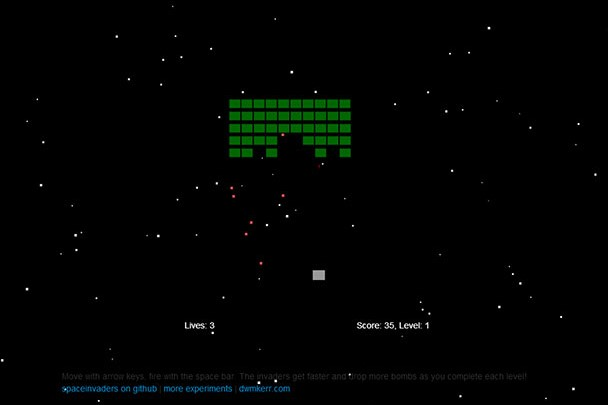

# SPACE INVADERS
👨‍🏫JOGO EM HTML/CSS/JS.

   

## DESCRIÇÃO:
O jogo é uma versão clássica de **Space Invaders**, onde você controla uma nave que se move para a esquerda e para a direita na parte inferior da tela. Seu objetivo é destruir ondas de inimigos que descem gradualmente.

## COMO JOGAR?
- **Movimentação**: Use as setas do teclado (esquerda e direita) para mover a nave.
- **Atirar**: Pressione a barra de espaço para disparar contra os inimigos.
- **Controles em Dispositivos de Toque**: Você pode deslizar para mover a nave e tocar na tela para disparar.

Conforme você avança, os inimigos se movem mais rapidamente e deixam cair mais bombas. O objetivo é sobreviver e acumular a maior pontuação possível.

## NÃO SABE?
- Entendemos que para manipular arquivos em `HTML`, `CSS` e outras linguagens relacionadas, é necessário possuir conhecimento nessas áreas. Para auxiliar nesse aprendizado, oferecemos cursos gratuitos disponíveis:
* [CURSO DE HTML E CSS](https://github.com/VILHALVA/CURSO-DE-HTML-E-CSS)
* [CURSO DE JAVASCRIPT](https://github.com/VILHALVA/CURSO-DE-JAVASCRIPT)
* [CURSO DE CANVAS](https://github.com/VILHALVA/CURSO-DE-CANVAS)
* [CONFIRA MAIS CURSOS](https://github.com/VILHALVA?tab=repositories&q=+topic:CURSO)

## CREDITOS:
- [PROJETO CRIADO PELO "dwmkerr"](https://github.com/dwmkerr/spaceinvaders)
- [PROJETO EDITADO PELO VILHALVA](https://github.com/VILHALVA)
